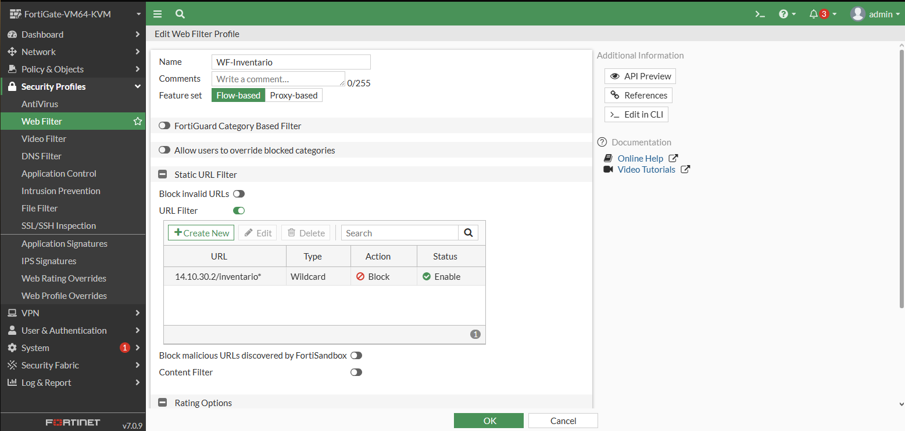
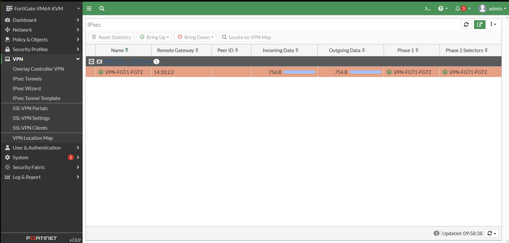

Video: https://youtu.be/9dxkry8HRus

El proposito de esta topologia es comprobar las diferentes habilidades aprendias a través del 1er periodo del cuatrimestre, estableciendo conexiones VPN entre fortigates, colocando filtros web y como gestionarlo.

DIRECCIONAMIENTO EN BASE A MATRICULA 2025-1410

## Tabla VLSM (red base 14.10.0.0/16)

| # | Segmento | Red | Máscara | Prefijo | Hosts | Rango útil | Broadcast |
|---|----------|-----|---------|---------|-------|------------|-----------|
| 1 | VLAN 10 (Usuarios) | 14.10.10.0 | 255.255.255.128 | /25 | 126 | 14.10.10.1 - 14.10.10.126 | 14.10.10.127 |
| 2 | VLAN 20 (Admin) | 14.10.20.0 | 255.255.255.128 | /25 | 126 | 14.10.20.1 - 14.10.20.126 | 14.10.20.127 |
| 3 | Web Server | 14.10.30.0 | 255.255.255.240 | /28 | 14 | 14.10.30.1 - 14.10.30.14 | 14.10.30.15 |
| 4 | DB Server | 14.10.31.0 | 255.255.255.240 | /28 | 14 | 14.10.31.1 - 14.10.31.14 | 14.10.31.15 |
| 5 | Enlace ISP - FGT1 | 14.10.1.0 | 255.255.255.252 | /30 | 2 | 14.10.1.1 - 14.10.1.2 | 14.10.1.3 |
| 6 | Enlace ISP - FGT2 | 14.10.2.0 | 255.255.255.252 | /30 | 2 | 14.10.2.1 - 14.10.2.2 | 14.10.2.3 |

## Direcciones por equipo

| Equipo | Interfaz | IP | Máscara | Gateway |
|--------|----------|----|---------|---------|
| ISP | e0/0 | 14.10.1.1 | /30 | - |
| ISP | e0/1 | 14.10.2.1 | /30 | - |
| ISP | e0/2 | DHCP (nube NAT) | - | - |
| FortiGate 1 | port1 (WAN) | 14.10.1.2 | /30 | 14.10.1.1 |
| FortiGate 1 | VLAN10 (en port2) | 14.10.10.1 | /25 | - |
| FortiGate 1 | VLAN20 (en port2) | 14.10.20.1 | /25 | - |
| FortiGate 2 | port1 (WAN) | 14.10.2.2 | /30 | 14.10.2.1 |
| FortiGate 2 | port2 | 14.10.30.1 | /28 | - |
| FortiGate 2 | port3 | 14.10.31.1 | /28 | - |
| PC VLAN10 | eth1 | DHCP (14.10.10.10 - .120) | /25 | 14.10.10.1 |
| PC VLAN20 | eth1 | 14.10.20.2 | /25 | 14.10.20.1 |
| Web Server | eth1 | 14.10.30.2 | /28 | 14.10.30.1 |
| DB Server | eth1 | 14.10.31.2 | /28 | 14.10.31.1 |

DIAGRAMA

INTERFACES

FORTIGATE 1

FORTIGATE2

POLITICAS DE FIREWALL

FORTIGATE 1

FORTIGATE2

WEB FILTER

VPNS

FORTIGATE 1

FORTIGATE2

