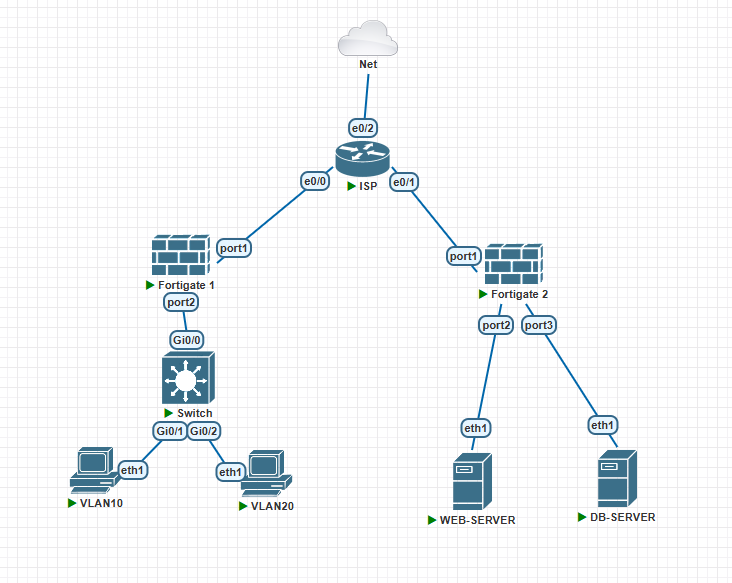
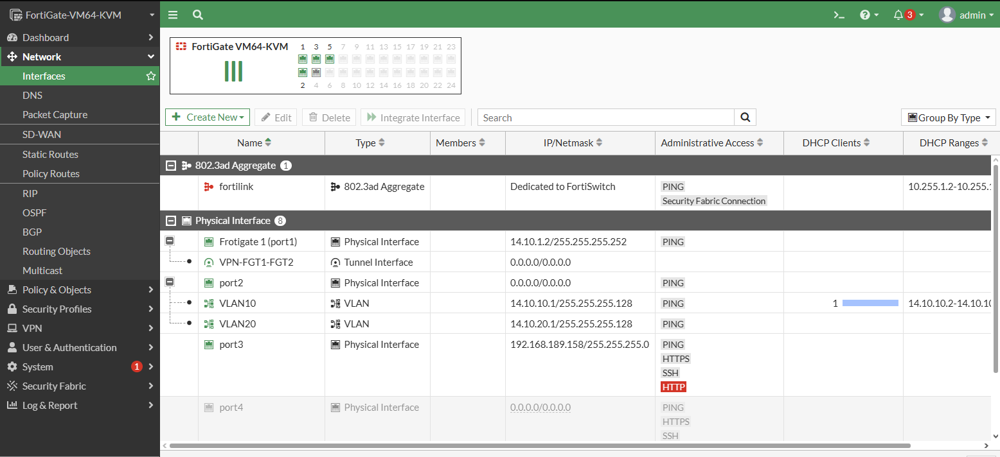
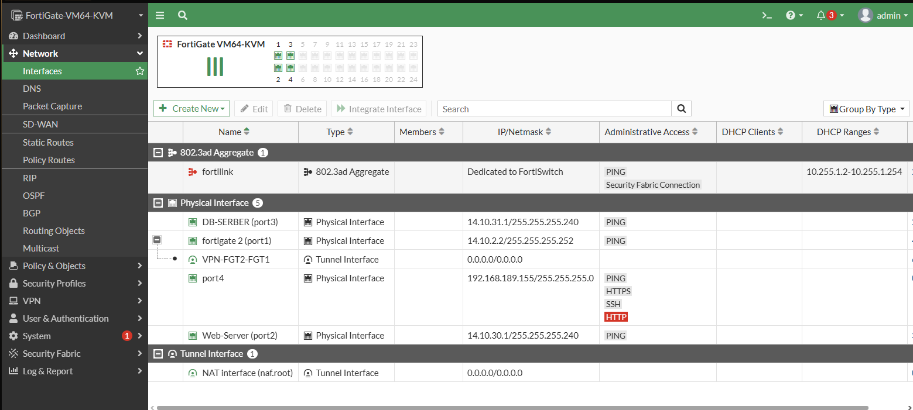

Video: https://youtu.be/9dxkry8HRus

El proposito de esta topologia es comprobar las diferentes habilidades aprendias a través del 1er periodo del cuatrimestre, estableciendo conexiones VPN entre fortigates, colocando filtros web y como gestionarlo.

DIAGRAMA

INTERFACES

FORTIGATE 1

FORTIGATE2

POLITICAS DE FIREWALL

FORTIGATE 1

FORTIGATE2

